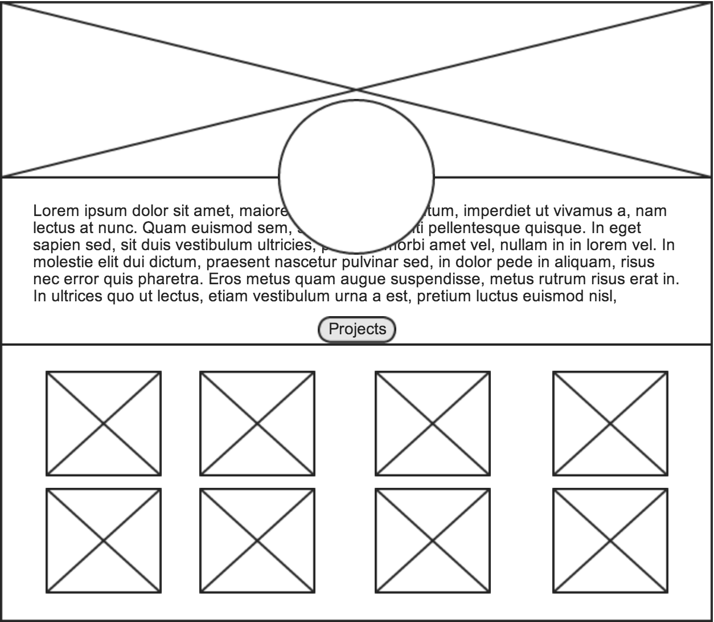
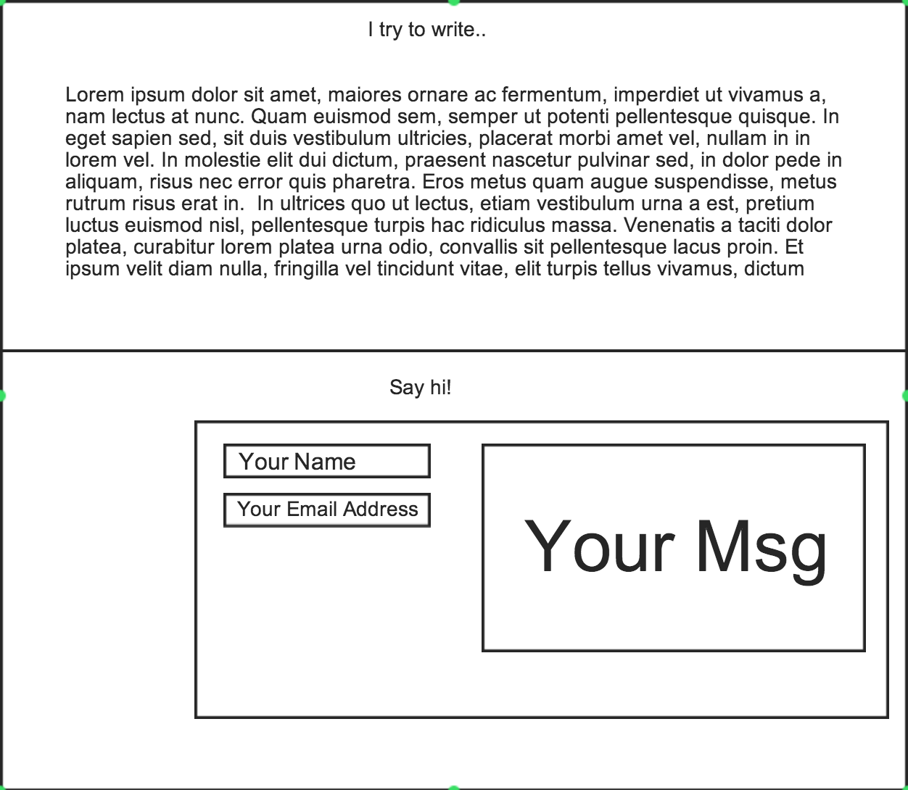

## Release 0: Revisit your github.io site
What are your impressions? What do you think of the experience when compared to other websites you like? Jot some notes on what you would like to change. You can also decide to completely rework your CSS and HTML.
I would want...

I do not like how it is too playful want to make it 'slighty' more professional
I would like to create a space where I can display my works 
I would like to create a space where I can display my blog posts 
I would like to create a contact space with form where they can fill out msg,name,email 

I would like to keep...

vertical layout because it looks like a resume/porfolio
new menubar but same concept of teleporting to sections

## Release 1: Wireframe/Modify your site
You can either choose to implement Jekyll on your github.io page or you can write all of your HTML and CSS again. Make it look awesome!

## Release 2: Get Reviews

After the feedback I am thinking about implementing a div where I can display few previews (fixed # of characters) of my blogs

## Release 3: Integrate the feedback

I have not implemented the blog yet but I implemented my general
wireframe which looks more organized than before 

## Release 4: Deploy to a personal URL
**OPTIONAL:** Look up how to deploy your github.io site to your own personal domain!

## Reflect

This exercise took really long time planning and starting from scratch. I feel like I have a decent understanding of html and css however it doesn't fail to break on me when I am setting up my divs in the beginning. But after everything
is set up including making it responsive, filling out the divs with elements are a breeze especially when I have all 
the planning done. One of the problem that I am still facing is implementing the blog in a beautiful and simple manner. 
The way I want to set it up with previews I had to have some knowledge on RSS FEED and XML. Im going to research on it
and try it asap! 