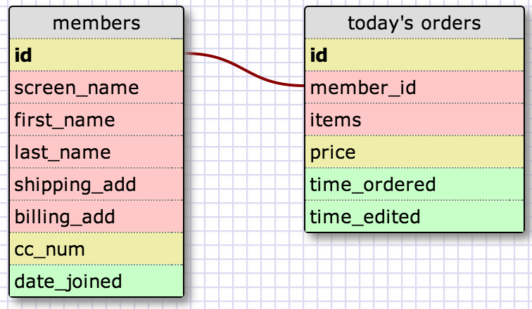

<!-- ## Show the terminal output here.  -->
## Release 1: Design the Schema

##Release 2 + 3: Add the schemas and Join tables 

    sqlite> CREATE TABLE members (
       ...> id INTEGER PRIMARY KEY AUTOINCREMENT,        
       ...> screen_name VARCHAR(64) NOT NULL,
   	   ...> first_name VARCHAR(64) NOT NULL,
       ...> last_name VARCHAR(64) NOT NULL,
       ...> billing_add VARCHAR(64) NOT NULL,
       ...> cc_num INTEGER NOT NULL,
       ...> date_joined DATETIME NOT NULL
       ...> );
    sqlite> CREATE TABLE orders_today (
       ...> id INTEGER PRIMARY KEY AUTOINCREMENT,
       ...> member_id INTEGER NOT NULL,
       ...> items VARCHAR(100) NOT NULL,
       ...> price integer NOT NULL,
       ...> time_ordered DATETIME NOT NULL,
       ...> time_edited DATETIME NOT NULL,
       ...> FOREIGN KEY(member_id) REFERENCES members(id)
       ...> );

##Release 4: Enter Data
    
    sqlite> Insert INTO members (screen_name,first_name,last_name,billing_add,cc_num,date_joined)
        ...> VALUES ('iamthejoker','Joker','Bad','55 Secret City',8888920356383322,'2010-03-07 08:00:00');
    sqlite> Insert INTO members (screen_name,first_name,last_name,billing_add,cc_num,date_joined)
        ...> VALUES ('bart1234','Bart','Simpson','1 Springfield',6368320356381145,'2010-08-03 08:31:00');

    sqlite> select * from members;
    id          screen_name  first_name  last_name   billing_add        cc_num            date_joined        
    ----------  -----------  ----------  ----------  -----------------  ----------------  -------------------
    1           kevinkang88  kevin       kang        100 Francisco Way  1232123212321232  2010-01-01 11:00:00
    2           batmanbest0  Batman      Dark        99 Gothem City     9224920356382933  2009-01-01 10:00:00
    3           iamthejoker  Joker       Bad         55 Secret City     8888920356383322  2010-03-07 08:00:00
    4           bart1234     Bart        Simpson     1 Springfield      6368320356381145  2010-08-03 08:31:00
    5           flyairforce  Barak       Obama       2 White House      2221920356312341  2011-03-08 02:00:00
    6           stantheman   Stan        Marsh       500 Southpark Blv  4623920356392531  2012-09-22 02:21:00
    7           ceodisneyla  Micky       Mouse       1 Disneyland       1111111156392531  2012-09-28 02:25:00
    8           imyourson    Luke        Skywalker   1314 Galaxy Air    3751637485918275  2012-10-11 07:02:00
    9           imyourfathe  Darth       Vader       1315 Galaxy Air    1113213485913143  2013-11-12 08:11:31
    11          pneumonoult  Stewie      Griffin     20 townsend blvd   1934443485913143  2014-04-12 12:11:00

##Release 5: Relection

This was a good exercise for me because I wasn’t comfortable with simple sqlite tasks 
yet. I decided to make databases assuming that it was an e-commerce website. One of 
the table is holding all the members information and the other table has list of all 
the orders from today including member_id as a foreign key.I learned that VARCHAR and 
CHAR datatypes hold upper and lower case letters, numbers, and also special characters 
which is suitable for holding things such as emails. Core difference between Varchar 
and Char is that Varchar holds variable length while char holds fixed length. Also 
use char when its fixed because it is 50% faster using static memory allocation instead 
of dynamic memory allocation.
